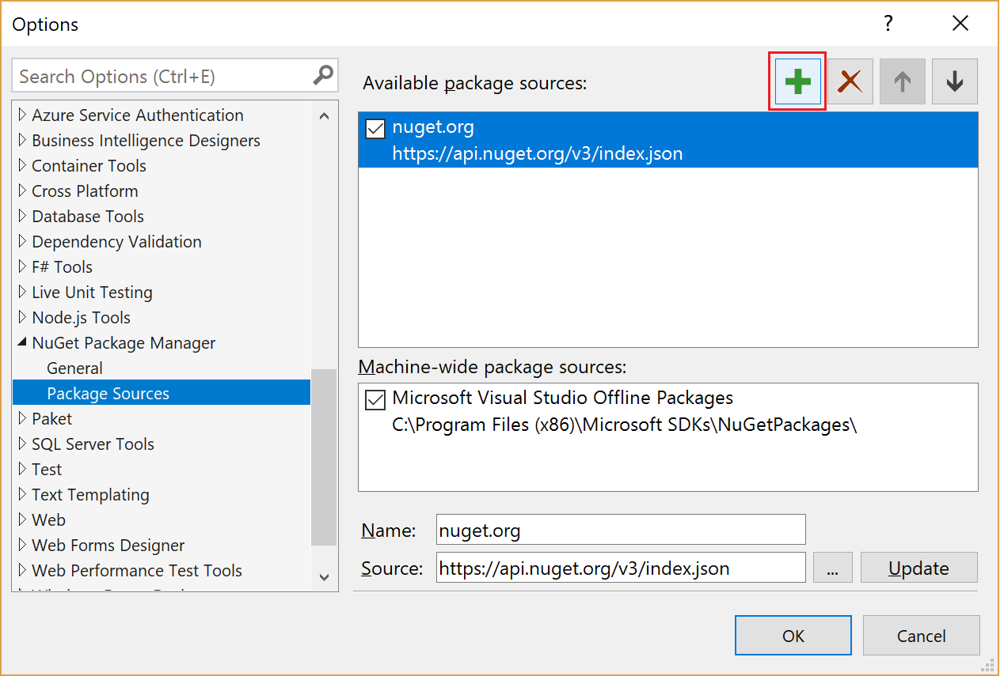

# چطور از فید های ناگت استفاده کنیم؟
# How to consume NuGet Feeds

<div dir="rtl" style="font-family: Tahoma; direction: rtl; text-align: right;">
برای استفاده از Nuget Source (یا Nuget Feed) های داخلی نیاز است که مسیر آن ها به یکی از روش های زیر به پروژه معرفی شود تا بتواند با آن feed ارتباط داشته باشد. این کار را می توان در چند سطح مختلف انجام داد
</div>

1. در سطح یک پروژه یا سلوشن
2. در سطح سیستم عامل
   a.	از طریق خط فرمان
   b.	از طریق ویرایش فایل با ویرایشگر متنی
   c.	از طریق پیکربندی ویژوال استودیو

## 1. در سطح یک پروژه یا سلوشن:

در مسیر ریشه پروژه (جایی که فایل *.sln یا فایل *.csproj قرار دارد)، یک فایل با نام nuget.config با محتویات زیر اضافه می کنیم:

```xml
<configuration>
  <solution>
    <add key="disableSourceControlIntegration" value="true" />
  </solution>
  <packageSources>
    <add key="NugetSharedFolder" value="\\SharedFolder\NugetPackages\Public" />
    <add key="MyAzureFeed" value="https://pkgs.dev.azure.com/HiDevOps/MyProject/_packaging/MyFeed/nuget/v3/index.json" />
    <add key="nuget.org" value="https://api.nuget.org/v3/index.json" protocolVersion="3" />
  </packageSources>
  <packageRestore>
    <add key="enabled" value="true" />
  </packageRestore>
</configuration>
```

## 2. در سطح کاربر سیستم عامل:

### a. از طریق خط فرمان و با اجرای دستورات زیر:

دستور اول برای اضافه کردن سورس پکیج های public که قبلا از روی اینترنت تهیه و در یک Shared Folder ذخیره شده است

```
nuget.exe sources Add –Name "NugetSharedFolder"-Source \\SharedFolder\NugetPackages\Public
```

دستور دوم برای اضافه کردن سورس پکیج های تولید شده توسط خودمان که معمولا به صورت private است و در این مثال در Azure Feeds نگهداری می شوند

```
nuget.exe sources Add –Name "MyAzureFeed"-Source  https://pkgs.dev.azure.com/HiDevOps/MyProject/_packaging/MyFeed/nuget/v3/index.json 
```

### b)	از طریق ویرایش فایل NuGet.config

```
%AppData%\Roaming\NuGet\NuGet.Config
```

و اضافه کردن بخش زیر در configuration

```xml
<?xml version="1.0" encoding="utf-8"?>
<configuration>
  <packageSources>
    <add key="NugetSharedFolder" value="\\SharedFolder\NugetPackages\Public" />
    <add key="MyAzureFeed" value="https://pkgs.dev.azure.com/HiDevOps/MyProject/_packaging/MyFeed/nuget/v3/index.json" />
    <add key="nuget.org" value="https://api.nuget.org/v3/index.json" protocolVersion="3" />
  </packageSources>
</configuration>
```

### c.	از طریق Visual Studio

1. On the Tools menu, select Options.
2. Expand NuGet Package Manager and select Package Sources.
3. Select the green plus in the upper-right corner.
   
4. At the bottom of the dialog box, enter the feed's name and the URL
   https://pkgs.dev.azure.com/HiDevOps/MyProject/_packaging/MyFeed/nuget/v3/index.json
5. Select Update.
6. If you enabled the nuget.org upstream source, clear the check box for the nuget.org package source.
7. Select OK

</div>
